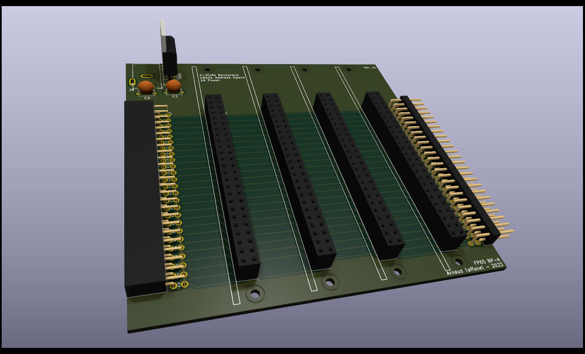

# 4 Board FP65 backplane

Backplane that can accept 4 FP65 boards and that can be chained to other backplane to accomodate bigger system.

A power supply can optionaly be soldered in order to provide up to 5V 1A to the system.
One of the board can also provide power for the system.