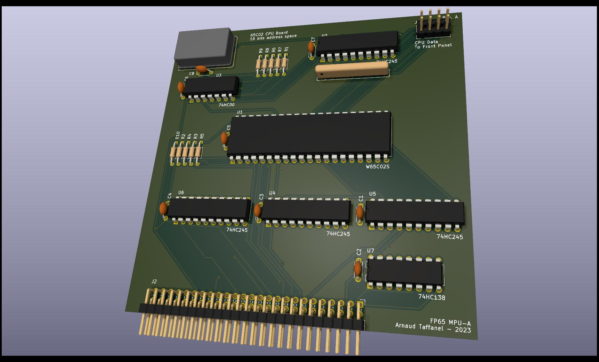

# wdc65C02s CPU board with clock

CPU board for the 65C02.



Implements support for a crystall oscillator and connector and logic for a front-pannel to access the CPU data line even when isolated from the backplane.

Also generates an enable signal for selecting the IO pages at ```$Cxxx```.
